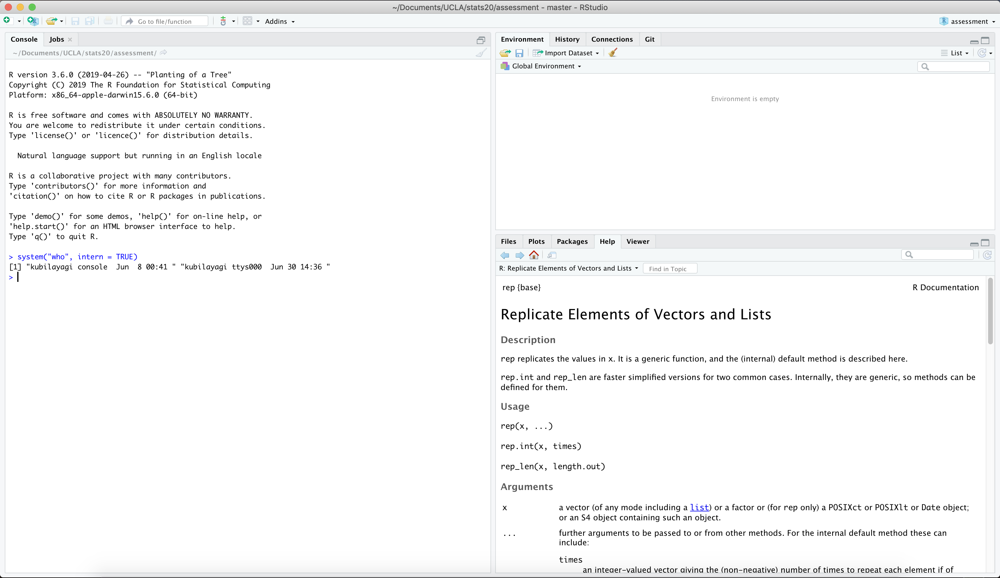

```{r setup, include=FALSE}
knitr::opts_chunk$set(echo = TRUE)
```


## Section 1

```{r}
system("who", intern = TRUE)
```



  \

  \

## Section 2
```{r}
find.package("tidyverse")
```

```{r}
find.package("readr")
```

```{r}
find.package("foreign")
```
  \

## Section 3
### 3.1

#### Part A
```{r}
(79 - 32) * 5 / 9
```
  \

#### Part B
```{r}
tf <- as.numeric(nhtemp)
tc <- (tf - 32) * 5 / 9
tc
```


### 3.2

#### Part A
```{r}
cv <- c("wrath", "avarice", "sloth", "pride", "lust", "envy", "gluttony")
cv
```
  \

#### Part B
```{r}
cv[6:7]
```
  \

#### Part C
This code received an error because R has no way to properly cast characters to integers in order to perform an integer operation. The reason that the code worked when adding three to the vector b is because logcial (boolean) values can be cast easily into integers, represented as either 1 for TRUE or 0 for FALSE.

### 3.3
#### Part A
##### Method 1
```{r}
w <- matrix(49:20, nrow = 6, ncol = 5, byrow = TRUE)
w
```

##### Method 2
```{r}
x <- 49:20
dim(x) <- c(5,6)
x <- t(x)
x
```

##### Method 3
```{r}
y <- rbind(49:45, 44:40, 39:35, 34:30, 29:25, 24:20)
y
```
  \

#### Part B
##### Extract 3rd row only
```{r}
w[3,]
```
  \

#### Part C
##### 2nd, 4th columns only
```{r}
cbind(w[,2], w[,4])
```

### 3.4
#### Part A
From the data frame sets that I found using the data() function, I chose to use the one call USJudgeRatings.
```{r}
data(USJudgeRatings)
```
  \

#### Part B
```{r}
class(USJudgeRatings)
mode(USJudgeRatings)
```
  \

#### Part C
```{r}
str(USJudgeRatings)
```
  \

#### Part D
##### i.
```{r}
USArrests["California",]
```

##### ii.
```{r}
USArrests$UrbanPop
```

##### iii.
```{r}
USArrests[USArrests$Murder == min(USArrests$Murder),]
```

##### iv.
```{r}
USArrests[USArrests$UrbanPop >= 85,]
```
  \

## Section 4
### Part A
#### Pseudocode
```{r}
# Pseudocode
# Input temperature in Fahrenheit
# Check the type to make sure it's a numeric
  # If its not, return an error message
  # Stop
# If we've reached this point, then we've received valid input, do the conversion
# Subtract 32 from the value
# Multiply by 5
# Divide by 9
# Output temperature in Celsius
```
  \

### Part B
```{r}
f2c <- function(t) {
  if (!is.numeric(t)) {
    stop("please input a numeric value")
  }
  (t - 32) * 5 / 9
}
```
  \

#### Test Cases
These are the four test cases that I chose to test my function. The first one represents a basic case with numeric values. The rest of the tests are tests that should fail because they are not numeric values. The fourth test case is a tricky one because R can cast a boolean logical value into an integer value if it needs to, so we check the type before doing the conversion.

```{r}
t1 <- c(0, -354, 100)
t2 <- "Stats20"
t3 <- 'x'
t4 <- FALSE
```
  \

##### Test 1
```{r}
f2c(t1)
```
  \

##### Test2 (Expected to fail)
```{r error=TRUE}
f2c(t2)
```
  \

##### Test 3 (Expected to fail)
```{r error=TRUE}
f2c(t3)
```
  \

##### Test 4 (Expected to fail)
```{r error=TRUE}
f2c(t4)
```


