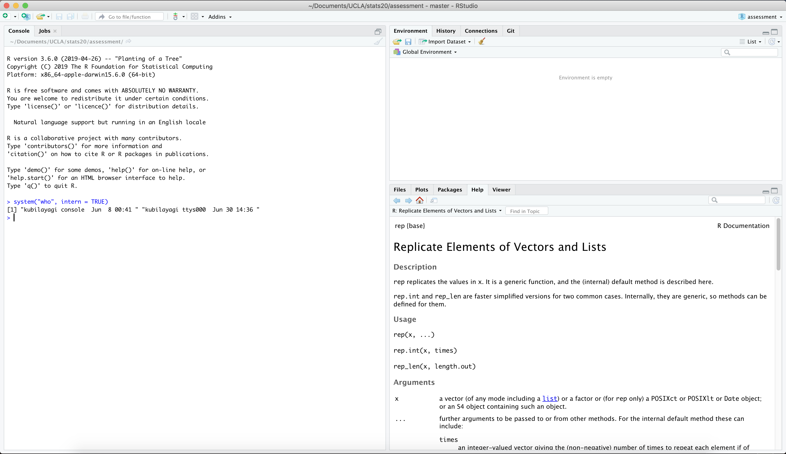

```{r setup, include=FALSE}
knitr::opts_chunk$set(echo = TRUE)
```

# Lab 1 Report

## Section 1

```{r}
system("who", intern = TRUE)
```




## Section 2
```{r}
find.package("tidyverse")
```

```{r}
find.package("readr")
```

```{r}
find.package("foreign")
```

## Section 3

### 3.1

#### Part A
```{r}
(79 - 32) * 5 / 9
```

#### Part B
```{r}
tf <- as.numeric(nhtemp)
tc <- (tf - 32) * 5 / 9
tc
```


### 3.2

#### Part A
```{r}
cv <- c("wrath", "avarice", "sloth", "pride", "lust", "envy", "gluttony")
```

#### Part B
```{r}
cv[6:7]
```

#### Part C
This code received an error because R has no way to properly cast characters to integers in order to perform an integer operation. The reason that the code worked when adding three to the vector b is because logcial (boolean) values can be cast easily into integers, represented as either 1 for TRUE or 0 for FALSE.

### 3.3
#### Part A
##### Method 1
```{r}
w <- matrix(49:20, nrow = 6, ncol = 5, byrow = TRUE)
w
```

##### Method 2
```{r}
x <- 49:20
dim(x) <- c(5,6)
x <- t(x)
x
```

##### Method 3
```{r}
y <- rbind(49:45, 44:40, 39:35, 34:30, 29:25, 24:20)
y
```

#### Part B
##### Extract 3rd row only
w[3,]

#### Part C
##### 2nd, 4th cols only
cbind(w[,2], w[,4])

### 3.4
#### Section A

```{r}
data(USJudgeRatings)
```

#### Section B
```{r}
class(USJudgeRatings)
mode(USJudgeRatings)
```

#### Section C
```{r}
str(USJudgeRatings)
```

#### Section D
##### i.
```{r}
USArrests["California",]
```

##### ii.
```{r}
USArrests$UrbanPop
```

##### iii.
```{r}
USArrests[USArrests$Murder == min(USArrests$Murder),]
```

##### iv.
```{r}
USArrests[USArrests$UrbanPop >= 85,]
```

## Section 4
### Part A
#### Pseudocode
```{r}
# Pseudocode
# Input temperature in Fahrenheit
# Subtract 32 from the value
# Multiply by 5
# Divide by 9
# Output temperature in Celsius
```

### Part B
```{r}
f2c <- function(t) {
  (t - 32) * 5 / 9
}
```

