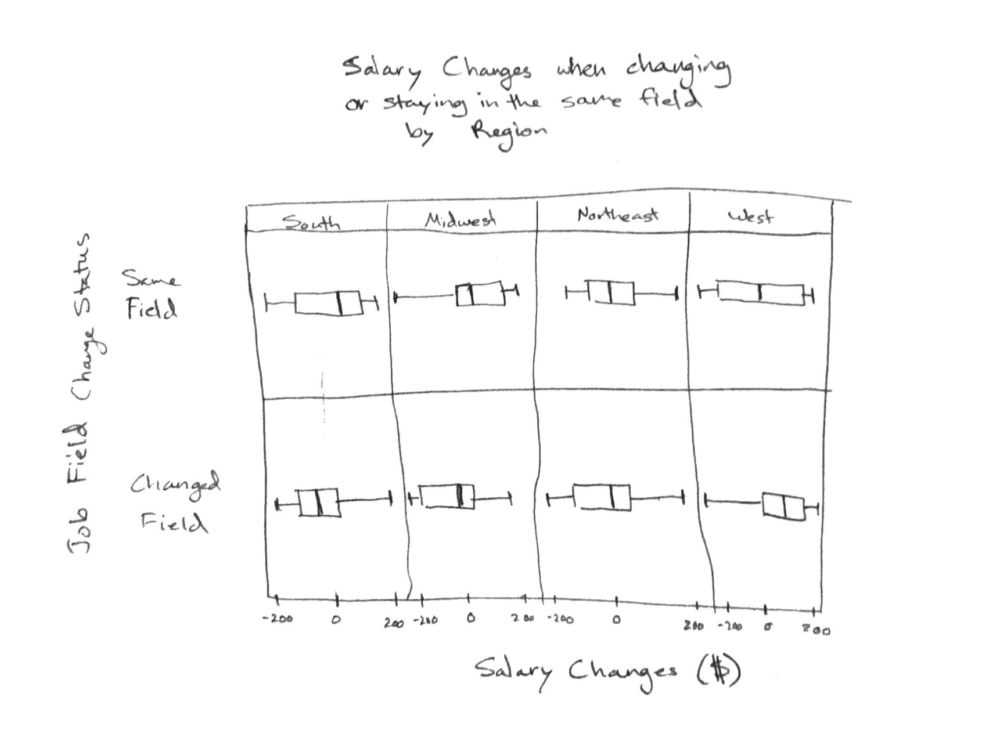

```{r setup, include=FALSE}
knitr::opts_chunk$set(echo = TRUE)
```


### Introduction

The PERM data set is a collection of applications for various jobs. There are 125 variables in this data set. Some examples are the application status, information about the employer, the requirements for the job, and the salary offered, amongst many others. This is a large data set with 117,645 observations. From the data set, I chose to focus on the relationship between the minimum level of education required for the job and the base salary offered for that job. My original hypothesis when performing this analysis that the averge wage would gradually increase based on the level of education. I expected to see the salaries to increase in order from None, High School, Associates, Bachelor's, Masters, to Doctorate. 

### Methodology

#### Code to produce graphic
##### Load Libraries
```{r}
library(readr)
library(ggplot2)
library(dplyr)
```

##### Choose the data being used
```{r}
PERM2018 <- read.csv("PERM2018.csv")

pdata <- select(PERM2018, CASE_NUMBER, EMPLOYER_NAME, WAGE_OFFER_FROM_9089, WAGE_OFFER_UNIT_OF_PAY_9089, JOB_INFO_WORK_STATE, JOB_INFO_JOB_TITLE, JOB_INFO_EDUCATION, JOB_INFO_EXPERIENCE_NUM_MONTHS)

rm(PERM2018)
```

##### Change Factor to numeric, filter out NAs, and subset data
```{r}
pdata$WAGE_OFFER_FROM_9089 <- gsub("#############", "0", pdata$WAGE_OFFER_FROM_9089)

pdata$WAGE_OFFER_FROM_9089 <- gsub(",", "", pdata$WAGE_OFFER_FROM_9089)

pdata <- subset(pdata, !is.na(pdata[,3]))
pdata <- subset(pdata, !is.na(pdata[,6]))
pdata <- subset(pdata, !is.na(pdata[,4]))
pdata <- subset(pdata, !is.na(pdata[,5]))
pdata <- subset(pdata, !(pdata[,7] == "NA" | pdata[,7] == "Other"))
pdata$WAGE_OFFER_FROM_9089 = as.numeric(pdata$WAGE_OFFER_FROM_9089)

pdata <- subset(pdata, pdata$WAGE_OFFER_FROM_9089 < 200000)
```

##### Convert all wages to yearly salaries
```{r}
salary <- function(df){
  for (i in 1:dim(df)[1]) {
    if (df$WAGE_OFFER_UNIT_OF_PAY_9089[i] == "Hour") {
      df$WAGE_OFFER_FROM_9089[i] = df$WAGE_OFFER_FROM_9089[i] * 40 * 50
    } else if (df$WAGE_OFFER_UNIT_OF_PAY_9089[i] == "Week") {
      df$WAGE_OFFER_FROM_9089[i] = df$WAGE_OFFER_FROM_9089[i] * 50
    } else if (df$WAGE_OFFER_UNIT_OF_PAY_9089[i] == "Bi-Weekly") {
      df$WAGE_OFFER_FROM_9089[i] = df$WAGE_OFFER_FROM_9089[i] * 25
    } else if (df$WAGE_OFFER_UNIT_OF_PAY_9089[i] == "Month") {
      df$WAGE_OFFER_FROM_9089[i] = df$WAGE_OFFER_FROM_9089[i] * 12
    }
    df$WAGE_OFFER_UNIT_OF_PAY_9089[i] = "Year"
  }
  return(df)
}

pdata <- salary(pdata)
```

##### Divide data up into regions
```{r}
# using https://en.wikipedia.org/wiki/List_of_regions_of_the_United_States

pdata <- mutate(pdata, JOB_INFO_REGION = "TERRITORY")

region <- function(df) {
  for (i in 1:dim(df)[1]) {
    state = df$JOB_INFO_WORK_STATE[i]
    if (is.na(state)) {
      print(i)
    }
    if (state == "WA" | state == "OR" | state == "CA" | state == "NV" | state == "ID" | state == "AZ"
        | state == "MT" | state == "UT" | state == "WY" | state == "CO" | state == "NM") {
      df$JOB_INFO_REGION[i] = "WEST"
    } else if (state == "ND" | state == "SD" | state == "NE" | state == "KS" | state == "MO"
               | state == "IA" | state == "MN" | state == "WI" | state == "IL" | state == "IN"
               | state == "OH" | state == "MI") {
      df$JOB_INFO_REGION[i] = "MIDWEST"
    } else if (state == "TX" | state == "OK" | state == "AR" | state == "LA" | state == "MS"
               | state == "AL" | state == "TN" | state == "KY" | state == "FL" | state == "GA"
               | state == "SC" | state == "NC" | state == "VA" | state == "WV" | state == "MD"
               | state == "DE" | state == "DC") {
      df$JOB_INFO_REGION[i] = "SOUTH"
    } else if (state == "PA" | state == "NY" | state == "NJ" | state == "CT" | state == "RI"
               | state == "MA" | state == "VT" | state == "NH" | state == "ME") {
      df$JOB_INFO_REGION[i] = "NORTHEAST"
    }
  }
  return(df)
}

pdata <- region(pdata)

pdata$JOB_INFO_REGION <- as.factor(pdata$JOB_INFO_REGION)

pdata <- subset(pdata, pdata$JOB_INFO_REGION != "TERRITORY")
```

##### Build the plot
```{r, , fig.width=11}
pdata <- subset(pdata, pdata$WAGE_OFFER_FROM_9089 < 200000)

g <- ggplot(pdata, aes(x = JOB_INFO_EDUCATION, y = WAGE_OFFER_FROM_9089, fill = JOB_INFO_EDUCATION)) + geom_boxplot() + facet_grid(. ~ JOB_INFO_REGION)

g + labs(title = "Salary Offered vs. Level of Education by Region", x = "Education Level (Degree)", y = "Salary Offered ($)", fill = "Education Level") + theme(plot.title = element_text(hjust = 0.5)) + coord_flip()
```

Several choices were made when performing analysis on this data set. First, all wages needed to be converted to yearly salaries in order for the analysis to work properly. Using the assumption that each job requires the employee to work 40 hours per week, and 50 weeks per year, the conversions were made using a function. Second, to get a better visual representation of the data in the histograms, I exluded jobs that were offering a salary of more than $200,000 per year. Third, the the "Other" and "NA" categories for Education Level were excluded from the analysis. The "Other" category is ambiguous, and the "NA" category should just be "None". The rows with NA values were difficult to interpolate, so those rows were also excluded from the analysis. I also chose to divide up the data based on region in the continguous United States (the 48 connected states) because different costs of living affect wages for jobs. In order to make it easier, the variable JOB_INFO_REGION was added to the dataset and was determined based on the [regions of the United States](https://en.wikipedia.org/wiki/List_of_regions_of_the_United_States). This variable was populated for each observation using a function as well. For the graphic, the design choices were fairly natural given the data that was looked at for this lab. Boxplots were used because they provide a simple way to visualize the percentiles and the common wages offered for the jobs. Additionally, they are useful when visualizing different categories; in this case, the categories are the education levels required for the jobs. GGPlot's facet grid feature was also used in order to show the separate data representation for each of the regions.

### Conclusion
The original hypothesis was that the median level of pay would increase as the level of education increases. However, we can see that the median salary offered for a job requiring a Doctorate is lower than the median salary offered for Master's and Bachelor's degrees across all four regions. Additionally, the median salary for jobs requiring a Master's degree is lower than the median salary for a job requiring only a Bachelor's degree. The median salaries for Bachelor's, Master's, and Doctorate are \$104,270, \$103,834, \$92,000 respectively. The other quartiles are shown below. This was quite surprising, as people with Doctorate degrees have spent much more time doing research in their field of expertise than any other degree listed here. 

```{}
Quartiles for Doctorate:
    0%    25%    50%    75%   100% 
 24066  72000  92000 118280 197925

Quartiles for Master's:
    0%    25%    50%    75%   100% 
 17472  87984 103834 122699 199755

Quartiles for Bachelor's:
    0%       25%       50%       75%      100% 
  0.00  80203.75 104270.00 124946.00 199999.00 
```

## Open Ended Questions

#### Part A
One of the extra columns that I would like to see in the data is the wage from the applicant's previous job. The name of this column could be along the lines of JOB_INFO_PREV_WAGE. This column would preferably hold numeric data instead of factor or character values, because it was tedious to convert the offered wage values that already exist in the data. This data would need to be provided by the applicant. If they are applying to their first job, then the field would be left as NA. The other column is the category of work that was done at the person's last job. The best estimation for this would be the major that was required for the job. This column would also be provided with the applicant. The column would be named as JOB_INFO_PREV_MAJOR and it would contain factor data types.

#### Part B 
One question we would be able to answer is: what improvements or losses do people make on average when moving to a new job? We could subtract the old wage from the new wage to see the difference in wage from the two jobs. The data from JOB_INFO_PREV_MAJOR would be used in tandem with the previous job's wages in order to answer another question: what improvements or losses do people make on average when switching to a different field of work. We would only use the jobs that were marked as "Certified" in the CASE_STATUS column because denied applicants will not be making the new salary. 


#### Part C


